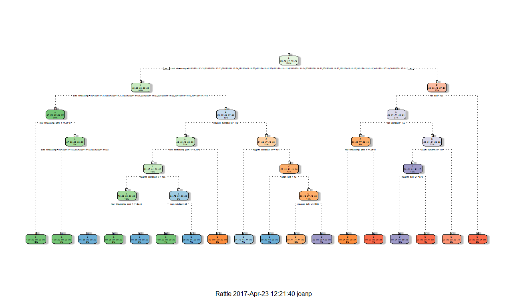

# Practical Machine Learning Project

One thing that people regularly do is quantify how much of a particular activity they do, but they rarely quantify how well they do it. In this project, the goal will be to use data from accelerometers on the belt, forearm, arm, and dumbell of 6 participants.

The project needs to predict the manner in which they did the exercise. This is the "classe" variable in the training set. We may use any of the other variables to predict with. We should create a report describing how we built our model, how we used cross validation, what we think the expected out of sample error is, and why we made the choices we did. We will also use our prediction model to predict 20 different test cases.


## Executive Summary  

Using devices such as JawboneUp, NikeFuelBand, and Fitbitit is now possible to collect a large amount of data about personal activity relatively inexpensively. These type of devices are part of the quantified self movement - a group of enthusiasts who take measurements about themselves regularly to improve their health, to find patterns in their behavior, or because they are tech geeks. One thing that people regularly do is quantify how much of a particular activity they do, but they rarely quantify how well they do it.

We will use data from `accelerometers` on the `belt`, `forearm`, `arm`, and `dumbell` of 6 participants. They were asked to perform barbell lifts correctly and incorrectly in 5 different ways. More information is available from the [website](http://groupware.les.inf.puc-rio.br/har) (see the section on the Weight Lifting Exercise Dataset).


## Data

The training data for this project are available [here](https://d396qusza40orc.cloudfront.net/predmachlearn/pml-training.csv). 
The test data are available [here](https://d396qusza40orc.cloudfront.net/predmachlearn/pml-testing.csv). 

The data for this project come from this [source](http://groupware.les.inf.puc-rio.br/har). If you use the document you create for this class for any purpose please cite them as they have been very generous in allowing their data to be used for this kind of assignment.


## Expected Results

1. Our submission should consist of a link to a Github repo with your R markdown and compiled HTML file describing your analysis. Please constrain the text of the writeup to < 2000 words and the number of figures to be less than 5. It will make it easier for the graders if we submit a repo with a gh-pages branch so the HTML page can be viewed online.

2. We should also apply our machine learning algorithm to the 20 test cases available in the test data above. We will submit our predictions in appropriate format to the programming assignment for automated grading.


## Reproducibility

Due to security concerns with the exchange of R code, our code will not be run during the evaluation by our classmates. We will ensure that if they download the repo, they will be able to view the compiled HTML version of our analysis.

In order to reproduce the same results, we will need a certain set of packages
*Note:To install, for instance, the caret package in R, run this command: `install.packages("caret")`

The following Libraries were used for this project and load as part of our working environment:

```r
library(caret)
```
*Output:*
```
## Loading required package: lattice
## Loading required package: ggplot2
```


```r
library(rpart)
library(rpart.plot)
library(RColorBrewer)
library(rattle)
```
*Output:*
```
## Rattle: A free graphical interface for data mining with R.
## Version 3.1.0 Copyright (c) 2006-2014 Togaware Pty Ltd.
## Type 'rattle()' to shake, rattle, and roll your data.
```


```r
library(randomForest)
```
*Output:*
```
## randomForest 4.6-10
## Type rfNews() to see new features/changes/bug fixes.
```

Finally, load the same seed with the following line of code:

```r
set.seed(12345)
```


## Data Normalization For Consumption

Environment Variables for Data consumption.

Training data set:

```r
trainUrl <- "http://d396qusza40orc.cloudfront.net/predmachlearn/pml-training.csv"
```
Testing data set:

```r
testUrl <- "http://d396qusza40orc.cloudfront.net/predmachlearn/pml-testing.csv"
```
Load data to memory:

```r
training <- read.csv(url(trainUrl), na.strings=c("NA","#DIV/0!",""))
testing <- read.csv(url(testUrl), na.strings=c("NA","#DIV/0!",""))
```

## Training Set Partioning

Partioning Training data set into two data sets, 60% for `myTraining`, 40% for `myTesting`:

```r
inTrain <- createDataPartition(y=training$classe, p=0.6, list=FALSE)
myTraining <- training[inTrain, ]; myTesting <- training[-inTrain, ]
dim(myTraining); dim(myTesting)
```

*Output:* 
```
## [1] 11776   160
```
```
## [1] 7846  160
```


The following transformations were used to normalize the data:

Transformation 1: Cleaning NearZeroVariance Variables

*View possible NZV Variables*

```r
myDataNZV <- nearZeroVar(myTraining, saveMetrics=TRUE)
```

Run this code to create another subset without NZV variables:

```r
myNZVvars <- names(myTraining) %in% c("new_window", "kurtosis_roll_belt", "kurtosis_picth_belt",
"kurtosis_yaw_belt", "skewness_roll_belt", "skewness_roll_belt.1", "skewness_yaw_belt",
"max_yaw_belt", "min_yaw_belt", "amplitude_yaw_belt", "avg_roll_arm", "stddev_roll_arm",
"var_roll_arm", "avg_pitch_arm", "stddev_pitch_arm", "var_pitch_arm", "avg_yaw_arm",
"stddev_yaw_arm", "var_yaw_arm", "kurtosis_roll_arm", "kurtosis_picth_arm",
"kurtosis_yaw_arm", "skewness_roll_arm", "skewness_pitch_arm", "skewness_yaw_arm",
"max_roll_arm", "min_roll_arm", "min_pitch_arm", "amplitude_roll_arm", "amplitude_pitch_arm",
"kurtosis_roll_dumbbell", "kurtosis_picth_dumbbell", "kurtosis_yaw_dumbbell", "skewness_roll_dumbbell",
"skewness_pitch_dumbbell", "skewness_yaw_dumbbell", "max_yaw_dumbbell", "min_yaw_dumbbell",
"amplitude_yaw_dumbbell", "kurtosis_roll_forearm", "kurtosis_picth_forearm", "kurtosis_yaw_forearm",
"skewness_roll_forearm", "skewness_pitch_forearm", "skewness_yaw_forearm", "max_roll_forearm",
"max_yaw_forearm", "min_roll_forearm", "min_yaw_forearm", "amplitude_roll_forearm",
"amplitude_yaw_forearm", "avg_roll_forearm", "stddev_roll_forearm", "var_roll_forearm",
"avg_pitch_forearm", "stddev_pitch_forearm", "var_pitch_forearm", "avg_yaw_forearm",
"stddev_yaw_forearm", "var_yaw_forearm")
```

```r
myTraining <- myTraining[!myNZVvars]
```

Verify the new NZV variables of observations

```r
dim(myTraining)
```

*Output:* 
```
## [1] 11776   100
```

Transformation 2: Remove first ID variable to eliminate impact to the Machine Learning Algorithms:

```r
myTraining <- myTraining[c(-1)]
```

*Output:* 
```
## [1] 11776   99
```

Transformation 3: Cleaning Variables with many NAs. 

*For Variables that have more than a 60% threshold of NA's we will leave them out*

```r
trainingV3 <- myTraining #creatingsubset to iterate in loop
for(i in 1:length(myTraining)) { #for every column in the training dataset
        if( sum( is.na( myTraining[, i] ) ) /nrow(myTraining) >= .6 ) { #if NZV NAs > 60% of total observations
        for(j in 1:length(trainingV3)) {
            if( length( grep(names(myTraining[i]), names(trainingV3)[j]) ) ==1)  { #if the columns are the same:
                trainingV3 <- trainingV3[ , -j] #Remove that column
            }   
        } 
    }
}
```

Verify the new NZV of observations

```r
dim(trainingV3)
```

*Output:* 
```
## [1] 11776    58
```

Seting back to our set

```r
myTraining <- trainingV3
rm(trainingV3)
```

Next Step is execute the same 3 transformations for our `myTesting` and `testing` data sets.

```r
clean1 <- colnames(myTraining)
clean2 <- colnames(myTraining[, -58]) #classe column removed
myTesting <- myTesting[clean1]
testing <- testing[clean2]
```

Verify the new NZV of observations

```r
dim(myTesting)
```

*Output:* 
```
## [1] 7846   58

```

```r
dim(testing)
```

*Output:* 
```
## [1] 20 57
```

To ensure proper functioning of Decision Trees and RandomForest Algorithm with the Test data set, we will need to coerce the data into the same type.

```r
for (i in 1:length(testing) ) {
        for(j in 1:length(myTraining)) {
        if( length( grep(names(myTraining[i]), names(testing)[j]) ) ==1)  {
            class(testing[j]) <- class(myTraining[i])
        }      
    }      
}
```

Ensure Coertion works as expected:

```r
testing <- rbind(myTraining[2, -58] , testing) #note row 2 does not mean anything, this will be removed right.. now:
testing <- testing[-1,]
```

## Decision Tree: Machine Learning Algorithms for Prediction

```r
modFitA1 <- rpart(classe ~ ., data=myTraining, method="class")
```

View the Decision Tree

```r
fancyRpartPlot(modFitA1)
```



## Predicting:

```r
predictionsA1 <- predict(modFitA1, myTesting, type = "class")
```

Using `confusionMatrix` to test results:

```r
confusionMatrix(predictionsA1, myTesting$classe)
```

*Output:* 
```
## Confusion Matrix and Statistics
## 
##           Reference
## Prediction    A    B    C    D    E
##          A 2150   60    7    1    0
##          B   61 1260   69   64    0
##          C   21  188 1269  143    4
##          D    0   10   14  857   78
##          E    0    0    9  221 1360
## 
## Overall Statistics
##                                           
##                Accuracy : 0.8789          
##                  95% CI : (0.8715, 0.8861)
##     No Information Rate : 0.2845          
##     P-Value [Acc > NIR] : < 2.2e-16       
##                                           
##                   Kappa : 0.8468          
##  Mcnemar's Test P-Value : NA              
## 
## Statistics by Class:
## 
##                      Class: A Class: B Class: C Class: D Class: E
## Sensitivity            0.9633   0.8300   0.9276   0.6664   0.9431
## Specificity            0.9879   0.9693   0.9450   0.9845   0.9641
## Pos Pred Value         0.9693   0.8666   0.7809   0.8936   0.8553
## Neg Pred Value         0.9854   0.9596   0.9841   0.9377   0.9869
## Prevalence             0.2845   0.1935   0.1744   0.1639   0.1838
## Detection Rate         0.2740   0.1606   0.1617   0.1092   0.1733
## Detection Prevalence   0.2827   0.1853   0.2071   0.1222   0.2027
## Balanced Accuracy      0.9756   0.8997   0.9363   0.8254   0.9536
```

Statistical Inference:

```
##  Accuracy : 0.8789          
##  95% CI : (0.8715, 0.8861)
##  No Information Rate : 0.2845          
##  P-Value [Acc > NIR] : < 2.2e-16 
##  Kappa : 0.8468
##  Mcnemar's Test P-Value : NA  
```


## Random Forests: Machine Learning Algorithms for Prediction
## Predicting:

```r
modFitB1 <- randomForest(classe ~. , data=myTraining)
```

Predicting in-sample error:

```r
predictionsB1 <- predict(modFitB1, myTesting, type = "class")
```

Using `confusionMatrix` to test results:

```r
confusionMatrix(predictionsB1, myTesting$classe)
```

*Output:* 
```
## Confusion Matrix and Statistics
## 
##           Reference
## Prediction    A    B    C    D    E
##          A 2231    2    0    0    0
##          B    1 1516    2    0    0
##          C    0    0 1366    3    0
##          D    0    0    0 1282    2
##          E    0    0    0    1 1440
## 
## Overall Statistics
##                                           
##                Accuracy : 0.9986          
##                  95% CI : (0.9975, 0.9993)
##     No Information Rate : 0.2845          
##     P-Value [Acc > NIR] : < 2.2e-16       
##                                           
##                   Kappa : 0.9982          
##  Mcnemar's Test P-Value : NA              
## 
## Statistics by Class:
## 
##                      Class: A Class: B Class: C Class: D Class: E
## Sensitivity            0.9996   0.9987   0.9985   0.9969   0.9986
## Specificity            0.9996   0.9995   0.9995   0.9997   0.9998
## Pos Pred Value         0.9991   0.9980   0.9978   0.9984   0.9993
## Neg Pred Value         0.9998   0.9997   0.9997   0.9994   0.9997
## Prevalence             0.2845   0.1935   0.1744   0.1639   0.1838
## Detection Rate         0.2843   0.1932   0.1741   0.1634   0.1835
## Detection Prevalence   0.2846   0.1936   0.1745   0.1637   0.1837
## Balanced Accuracy      0.9996   0.9991   0.9990   0.9983   0.9992
```

Statistical Inference:

```
##  Accuracy : 0.9986          
##  95% CI : (0.9975, 0.9993)
##  No Information Rate : 0.2845          
##  P-Value [Acc > NIR] : < 2.2e-16       
##  Kappa : 0.9982          
##  Mcnemar's Test P-Value : NA   
```

## Answer and Results:

Using the provided Test Set out-of-sample error.

For Random Forests we use the following formula, which yielded betters prediction in in-sample:

```r
predictionsB2 <- predict(modFitB1, testing, type = "class")
```

Function to generate files with predictions for assignment

```r
pml_write_files = function(x){
  n = length(x)
  for(i in 1:n){
    filename = paste0("problem_id_",i,".txt")
    write.table(x[i],file=filename,quote=FALSE,row.names=FALSE,col.names=FALSE)
  }
}

pml_write_files(predictionsB2)
```